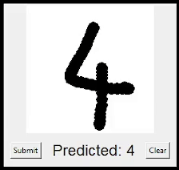

# Demo of Machine Learning Classifier with GUI



## Overview

This project showcases the training and testing of five Machine Learning models on the MNIST dataset and includes a GUI application for digit recognition.

### Dataset

- **Training Images**: 60,000
- **Test Images**: 10,000

### Models and Accuracy

- **Decision Tree**: 88% accuracy
- **K-Nearest Neighbors (KNN)**: 97% accuracy
- **Logistic Regression**: 93% accuracy
- **Random Forest**: 97% accuracy
- **Support Vector Classifier (SVC)**: 98% accuracy

## GUI Application

Developed using Tkinter, this GUI allows users to draw a number with their cursor, and the trained model predicts the digit based on its training.

## How to Run

1. Clone the repository:

    ```bash
    git clone https://github.com/HaroldELight/Harold-Lightfoot-Portfolio.git
    cd Harold-Lightfoot-Portfolio/Digit_Recognition_GUI_with_ML
    ```

3. Install the required dependencies:

    ```bash
    pip install -r requirements.txt
    ```

4. Run the Test file for each model.

## Download links for training data

t10k-images:  <https://www.kaggle.com/datasets/hojjatk/mnist-dataset?select=t10k-images.idx3-ubyte>
t10k-labels:  <https://www.kaggle.com/datasets/hojjatk/mnist-dataset?select=t10k-labels.idx1-ubyte>
train-images:  <https://www.kaggle.com/datasets/hojjatk/mnist-dataset?select=train-images.idx3-ubyte>
train-labels:  <https://www.kaggle.com/datasets/hojjatk/mnist-dataset?select=train-labels.idx1-ubyte>

## Dependencies

- Python 3.x
- Tkinter
- Pillow (`PIL`)
- NumPy (`numpy`)
- Matplotlib (`matplotlib`)
- Scikit-learn (`sklearn`)
- Joblib (`joblib`)

```python
from PIL import Image, ImageDraw
import numpy as np
import matplotlib.pyplot as plt
from sklearn.linear_model import LogisticRegression
import joblib
```


## Usage

1. Open the Test file for each model and run the App.
2. Use the cursor to draw a digit.
3. The model will predict and display the drawn digit.

## Authors

- Harold E Lightfoot

## License

This project is licensed under the MIT License - see the [LICENSE](LICENSE) file for details.

=======

# Digit_Recognition_GUI_with_ML

Digit Recognition GUI using Machine Learning

