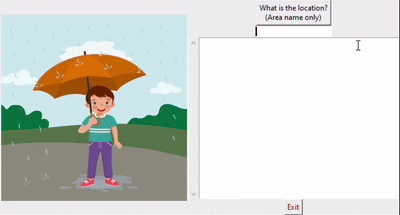

# Weather Clothing Advisor

This is a Tkinter-based GUI application that suggests clothing based on weather conditions. It integrates weather data from the Weather API and uses Google's generative AI (Gemini) to provide personalized advice.

## Demo

Here is a GIF demonstrating the application in action:



## Installation

1. Clone the repository:
    ```bash
    git clone https://github.com/HaroldELight/Harold-Lightfoot-Portfolio.git
    cd Harold-Lightfoot-Portfolio/Clothing_Advisor_GUI
    ```

2. Install the required dependencies:
    ```bash
    pip install -r requirements.txt
    ```

3. Add your API keys:
    - Open `config.ini` and replace `your_weather_api_key_here` and `your_google_api_key_here` with your actual API keys.

## Getting API Keys

### Weather API Key

1. Visit the [WeatherAPI website](https://www.weatherapi.com/).
2. Sign up for an account or log in if you already have one.
3. Navigate to the API section and create a new API key.
4. Copy the API key and paste it into the `WEATHER_API_KEY` field in `config.ini`.

### Google API Key

1. Visit the [Google Cloud Platform Console](https://console.cloud.google.com/).
2. Create a new project or select an existing project.
3. Navigate to the "APIs & Services" section and enable the `Generative AI` API.
4. Create credentials to obtain an API key.
5. Copy the API key and paste it into the `GOOGLE_API_KEY` field in `config.ini`.

## Usage

1. Run the application:
    ```bash
    python clothing_gui_app.py
    ```

2. Enter your location (area name only) to get weather-based clothing suggestions.

## Files

- `clothing_gui_app.py`: The main script for the application.
- `config.ini`: Configuration file for the API keys.
- `requirements.txt`: List of required Python packages.
- `gui_class.py`: Class for the GUI without the API's

## Contributing

Contributions are welcome! Please feel free to submit a Pull Request.

## License

This project is licensed under the MIT License.
